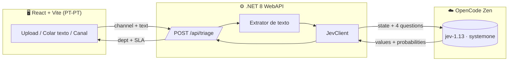

# 🏛️ JEV Triage — POC Setor Público Português

> **Da caixa de entrada caótica à equipa certa em segundos.**
> Classificação automática de reclamações municipais multicanal com o modelo **JEV (Typesafe)** via **OpenCode Zen**.


---

## ✨ O que faz

Um munícipe reclama pelo **portal**, por **email**, por **telefone**, ao **balcão** ou nas **redes sociais** — o texto chega todo ao mesmo sítio, e o JEV decide em **uma única chamada**:

| Sinal | Tipo JEV | Exemplo |
|---|---|---|
| 🏢 Departamento | `choice` | Águas e Saneamento (92%) |
| 🚨 Urgente? | `noul` | Sim (81%) |
| 😤 Frustração | `score` | Muito revoltado |
| 🎯 Prioridade + SLA | `choice` | **P1 — 24 horas** |

Sem prompts gigantes, sem texto livre para fazer parse — só **decisões tipadas com probabilidades**, prontas para usar em código. É isso que torna o JEV diferente de um LLM clássico.

---

## 🧱 Arquitetura



> 🔑 A `OPENCODE_API_KEY` **vive só no backend**. O frontend nunca fala com a Zen.

---

## 🚀 Arranque em 2 minutos

```powershell
# 1. Clonar + configurar a chave (https://opencode.ai/auth)
git clone https://github.com/AndreRochaDev/innovation-poc-jev.git
cd innovation-poc-jev
Copy-Item .env.example .env   # ← colar a OPENCODE_API_KEY

# 2a. Modo dev (recomendado p/ demo)
dotnet run --project backend/JevClassifier.Api --urls "http://localhost:5000"
cd frontend; npm install; npm run dev   # http://localhost:5173

# 2b. Ou tudo de uma vez com Docker
docker compose up --build   # web :5173 → api :5000
```

Abre o Swagger em `http://localhost:5000/swagger` se quiseres espreitar a API. 👀

---

## 🎬 Guião de demo (3 minutos, zero preparação)

1. Clica num **exemplo** — `telefone` 📞 (poste apagado à porta da escola, munícipe furioso).
2. Prime **Classificar com JEV** → vê `Iluminação Pública`, `Urgente: Sim`, `P1 · SLA 24 horas`.
3. Muda de canal para `portal` 📝 com o exemplo dos resíduos → `P2 · 5 dias úteis`.
4. Mostra o **top-3 de probabilidades** — é o momento "ah, isto dá para auditar!" 🤌

Amostras reais em `samples/*.txt`, uma por canal.

---

## 🔌 API

| Método | Endpoint | Para quê |
|---|---|---|
| `GET` | `/api/health` | `{"status":"ok","model":"jev-1.13-free"}` |
| `GET` | `/api/taxonomy` | Canais, departamentos, prioridades e modelo ativo |
| `POST` | `/api/triage` | JSON `{channel, text}` — o caminho principal |
| `POST` | `/api/classify` | `multipart` `{channel, text, file}` — upload `.txt/.md/.eml` |

Canais: `portal` · `email` · `telefone` · `balcao` · `redes_sociais`

---

## 🗂️ Taxonomia (toda configurável, zero código)

Tudo vive em `backend/JevClassifier.Api/appsettings.json` → secção `Triage`:

- 🏘️ **9 departamentos** — Águas, Resíduos, Espaços Verdes, Iluminação, Mobilidade, Urbanismo, Ação Social, Atendimento, Outro
- ⏱️ **3 prioridades** — P1 24h · P2 5 dias úteis · P3 20 dias
- 🤖 **Modelo** via `Jev:Model` ou env `Jev__Model` (`jev-1.13-free` por defeito, `jev-1.13` pago)

Mudas a taxonomia, reinicias a API, e a UI (`GET /api/taxonomy`) adapta-se sozinha. 🪄

---

## 📁 Estrutura

```
├── backend/JevClassifier.Api/   # Controllers, Services (JevClient, TriageService), Models
├── frontend/                    # React 19 + Vite + TS (App.tsx, lib/api.ts)
├── samples/                     # 5 reclamações demo, uma por canal
├── docker-compose.yml
└── .env.example                 # template — a tua .env real NUNCA entra no git 🔒
```

---

## 🗺️ Para onde pode ir (fora da POC)

- [ ] Conectores reais: IMAP, CSV em lote, API do portal
- [ ] Histórico + dashboard em Postgres
- [ ] Minuta de resposta automática (LLM gerativo a seguir ao JEV)
- [ ] SSO / Autenticação.gov.pt
- [ ] OCR para PDFs digitalizados (nesta POC o PDF devolve `422` — cola o texto)

---

## ⚠️ Nota de contexto público

Modelos Zen alojados nos **EUA** com política de zero-retention; o modelo `free` está em período experimental — **usar apenas dados anonimizados/demo**. Assume `confiancaBaixa` quando a top-probabilidade < 60%: rever manualmente.

---

<p align="center">Feito como POC de inovação para o setor público português 🇵🇹 · <code>.NET</code> + <code>React</code> + <code>JEV</code></p>
